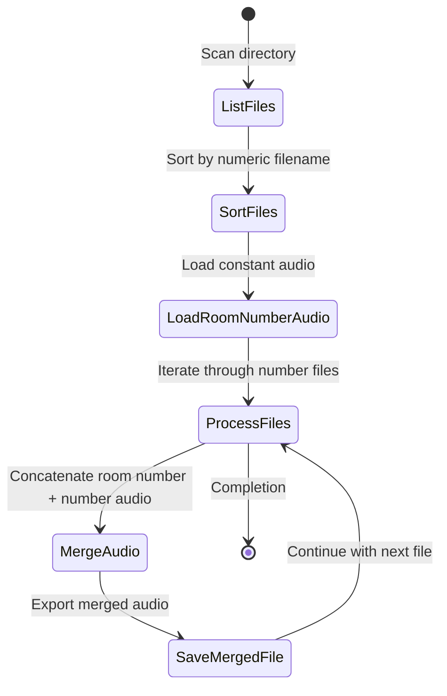

# Audio Room Number Merger

## Project Description
This Python script merges a constant "room number" audio file with individual number audio files to create comprehensive room number audio clips.

## Flowchart of Process



## Prerequisites
- Python 3.x
- `pydub` library
- `os` module

## Dependencies
- Install pydub: `pip install pydub`

## Project Structure
- `./number_audio/`: Directory containing individual number audio files
- `./room_number_audio.ogg`: Constant room number audio file
- `./merged_room_numbers/`: Output directory for merged audio files

## How It Works
1. Scans the `number_audio` directory
2. Sorts audio files based on numeric filename
3. Loads a constant room number audio file
4. Merges each number audio with the room number audio
5. Saves merged files in `merged_room_numbers` directory

## Usage
```bash
python audio_merger.py
```

## Example
- Input: `1.ogg`, `2.ogg`, `3.ogg`
- Constant Audio: `room_number_audio.ogg`
- Output: `room_number_1.ogg`, `room_number_2.ogg`, `room_number_3.ogg`

## Notes
- Ensure all input files are in `.ogg` format
- Filename must be numeric (e.g., `1.ogg`, `2.ogg`)
